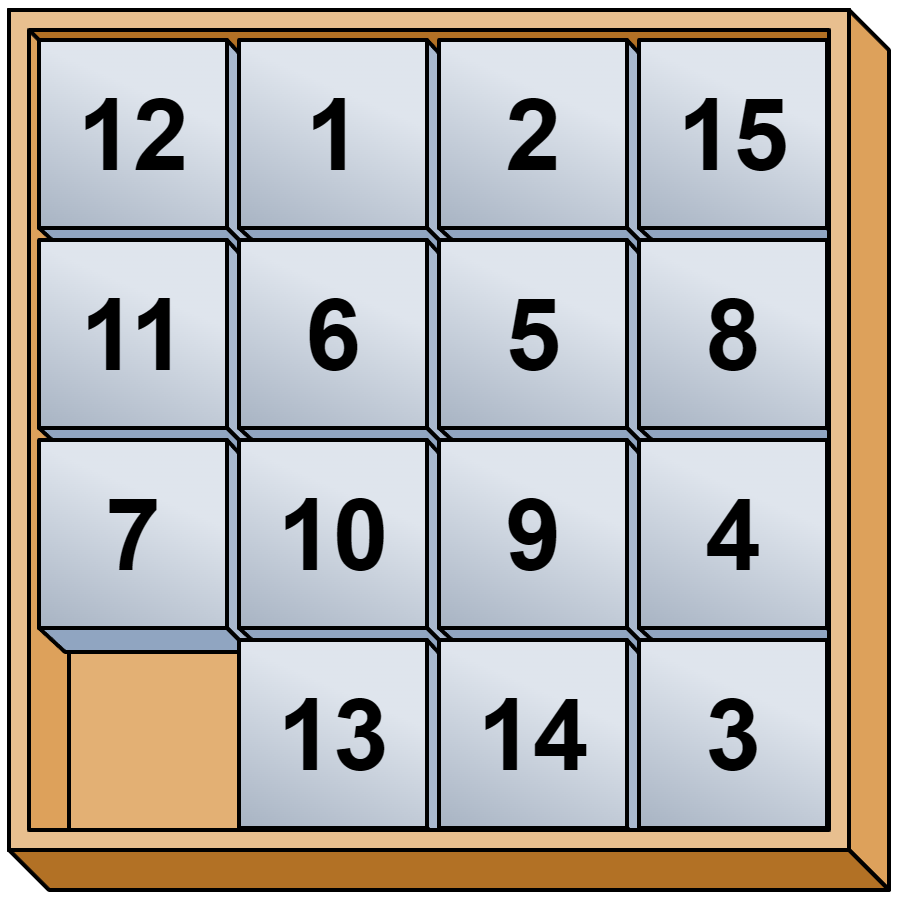

# Makalah Stima - 13522098

## Perbadingan Penerapan Algoritma IDS dan Branch and Bound dalam Penyelesaian Permainan 8-Puzzle
8-Puzzle adalah permainan  yang memiliki ubin persegi dengan nomor 1-8 dan satu buah ubin kosong. Ubin dengan yang bersebelahan langsung secara vertikal atau horizontal dengan ubin kosong dapat ditukar posisinya. Tujuan permainan ini adalah untuk mendapatkan puzzle dengan urutan angka numerik.

<br>
<p align="center">

</p>
<br>

## Requirements
Program ini menggunakan java versi 21+. Silahkan install terlebih dahulu JDK yang sesuai.

## Run Program
Pada project ini sudah disediakan file ```run.bat```. Silahkan jalankan file tersebut dengan command di bawah ini.

```
./run.bat
```

